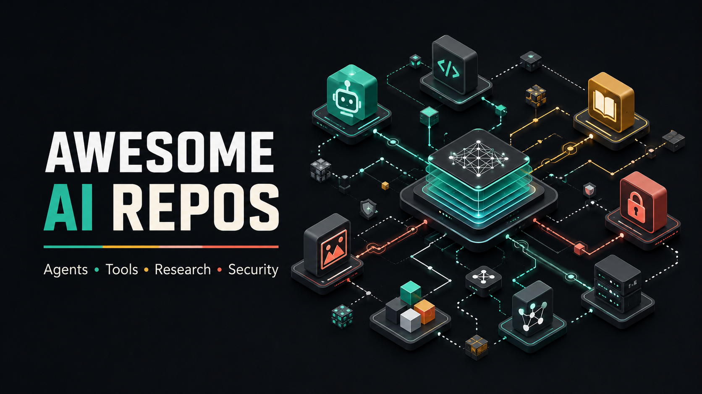

## 🤖 AI Agents & Agent Frameworks

- [langchain-ai/langchain](https://github.com/langchain-ai/langchain) — Framework for building LLM applications and agents with model, tool, and retrieval integrations.
- [lobehub/lobehub](https://github.com/lobehub/lobehub) — Platform for organizing and operating teams of AI agents with scheduling, knowledge, and MCP support.
- [langflow-ai/langflow](https://github.com/langflow-ai/langflow) — Visual platform for building and deploying AI agents and workflows.
- [openclaw/openclaw](https://github.com/openclaw/openclaw) — Cross-platform personal AI assistant designed to run on the user's own infrastructure.
- [paperclipai/paperclip](https://github.com/paperclipai/paperclip) — Orchestration app for managing teams of AI agents with goals, budgets, governance, and cost tracking.
- [msitarzewski/agency-agents](https://github.com/msitarzewski/agency-agents) — Collection of specialized AI agent definitions for engineering, design, marketing, and business roles.

## 💬 LLM Applications

- [lucaswalter/n8n-ai-automations](https://github.com/lucaswalter/n8n-ai-automations) — Collection of n8n workflows and templates for AI automations and agents.
- [koala73/worldmonitor](https://github.com/koala73/worldmonitor) — Global intelligence dashboard that uses AI to synthesize news feeds into situational briefs.
- [f/prompts.chat](https://github.com/f/prompts.chat) — Open-source application for sharing, discovering, and self-hosting prompts for LLMs.
- [macro-inc/macro](https://github.com/macro-inc/macro) — Unified team workspace combining email, documents, tasks, CRM, and action-taking AI agents with shared memory.

## 🛠️ AI Developer Tools

- [Panniantong/Agent-Reach](https://github.com/Panniantong/Agent-Reach) — CLI that gives AI agents search and reading access across social, video, and developer platforms.
- [HKUDS/CLI-Anything](https://github.com/HKUDS/CLI-Anything) — Toolkit for generating and testing command-line harnesses that let AI agents operate existing software.
- [firecrawl/firecrawl](https://github.com/firecrawl/firecrawl) — Context API for searching, scraping, and transforming web data for AI applications and agents.
- [semantica-agi/semantica](https://github.com/semantica-agi/semantica) — Graph-native context infrastructure for knowledge graphs, GraphRAG, provenance, and accountable AI systems.
- [diegosouzapw/OmniRoute](https://github.com/diegosouzapw/OmniRoute) — LLM gateway that routes requests across providers and models with quota-aware fallback and agent-tool support.

## 💻 AI Coding Assistants

- [awesome-opencode/awesome-opencode](https://github.com/awesome-opencode/awesome-opencode) — Curated list of plugins, themes, agents, projects, and resources for the OpenCode coding agent.
- [different-ai/openwork](https://github.com/different-ai/openwork) — Desktop app and MCP service for sharing reusable AI workflows across compatible agent clients.
- [DietrichGebert/ponytail](https://github.com/DietrichGebert/ponytail) — Coding-agent skill that guides implementations toward smaller and simpler code.
- [PrimeIntellect-ai/prime-agent](https://github.com/PrimeIntellect-ai/prime-agent) — Self-improving RLM agent for coding workflows and long-running autonomous tasks.
- [addyosmani/agent-skills](https://github.com/addyosmani/agent-skills) — Collection of production-oriented engineering skills for AI coding agents.
- [nextlevelbuilder/ui-ux-pro-max-skill](https://github.com/nextlevelbuilder/ui-ux-pro-max-skill) — Design knowledge skill for AI coding assistants building web and mobile interfaces.
- [anomalyco/opencode](https://github.com/anomalyco/opencode) — Open-source terminal-based AI coding agent.
- [pbakaus/impeccable](https://github.com/pbakaus/impeccable) — Design-language skill and plugin for improving interface output from AI coding harnesses.
- [Leonxlnx/taste-skill](https://github.com/Leonxlnx/taste-skill) — Frontend design skill for AI coding agents and low-code tools.
- [mattpocock/skills](https://github.com/mattpocock/skills) — Composable engineering workflow skills for Claude Code, Codex, and other coding agents.
- [obra/superpowers](https://github.com/obra/superpowers) — Skills-based software development methodology for coding agents, including planning, testing, and subagent workflows.

## 🔐 AI Security & Safety

- [ottosulin/awesome-ai-security](https://github.com/ottosulin/awesome-ai-security) — Curated collection of resources covering AI and LLM security.
- [uber/ADR](https://github.com/uber/ADR) — Framework for AI agent observability, security benchmarking, and threat detection.
- [zhaoxuya520/reverse-skill](https://github.com/zhaoxuya520/reverse-skill) — Skill router for AI agents performing authorized reverse engineering, security research, and penetration testing.
- [GreyDGL/PentestGPT](https://github.com/GreyDGL/PentestGPT) — LLM-powered agent framework for automated penetration testing.
- [Rizzo-AI-Academy/rizzo-pii](https://github.com/Rizzo-AI-Academy/rizzo-pii) — Local Italian PII detection model and reversible anonymization workflow for using sensitive documents with LLMs.
- [JailbrokenAI/wallbreaker](https://github.com/JailbrokenAI/wallbreaker) — Terminal-based AI red-team harness with automated attacks, benchmarks, target adapters, and LLM judging.
- [usestrix/strix](https://github.com/usestrix/strix) — Agentic penetration-testing tool for finding and validating application vulnerabilities.

## 🎨 Image & Video Generation

- [YouMind-OpenLab/awesome-nano-banana-pro-prompts](https://github.com/YouMind-OpenLab/awesome-nano-banana-pro-prompts) — Curated multilingual prompt library with previews for Gemini image-generation models.
- [FujiwaraChoki/MoneyPrinter](https://github.com/FujiwaraChoki/MoneyPrinter) — Ollama-powered pipeline for generating scripts, metadata, and videos for YouTube Shorts.
- [calesthio/OpenMontage](https://github.com/calesthio/OpenMontage) — Agentic video-production system with reusable pipelines, tools, and production skills.
- [Anil-matcha/Open-Generative-AI](https://github.com/Anil-matcha/Open-Generative-AI) — Self-hosted studio for generating images and videos through multiple generative models.
- [Comfy-Org/ComfyUI](https://github.com/Comfy-Org/ComfyUI) — Node-based GUI, API, and backend for diffusion-model image generation workflows.

## 📚 AI Research & Learning

- [VoltAgent/awesome-ai-agent-papers](https://github.com/VoltAgent/awesome-ai-agent-papers) — Curated collection of AI agent research papers on memory, evaluation, workflows, and autonomous systems.
- [kyrolabs/awesome-agents](https://github.com/kyrolabs/awesome-agents) — Curated directory of AI agents, frameworks, and related resources.
- [uhub/awesome-chatgpt](https://github.com/uhub/awesome-chatgpt) — Curated directory of ChatGPT-related applications, tools, and resources.
- [dair-ai/Prompt-Engineering-Guide](https://github.com/dair-ai/Prompt-Engineering-Guide) — Guides, papers, lessons, and notebooks for prompt engineering, RAG, and AI agents.
- [sindresorhus/awesome-chatgpt](https://github.com/sindresorhus/awesome-chatgpt) — Curated list of ChatGPT applications, extensions, and developer resources.

## 🔌 MCP & AI Integrations

- [activepieces/activepieces](https://github.com/activepieces/activepieces) — AI-first workflow automation platform with agent building and MCP-exposed integrations.
- [punkpeye/awesome-mcp-servers](https://github.com/punkpeye/awesome-mcp-servers) — Curated collection of servers for the Model Context Protocol.
- [oomol-lab/open-connector](https://github.com/oomol-lab/open-connector) — Authentication gateway connecting SaaS providers to AI agents through SDK, CLI, MCP, HTTP, and OpenAPI.

## Keywords

agentic-workflows, agent-orchestration, agent-memory, agent-observability, agent-security, ai-gateway, llm-gateway, model-routing, inference-routing, context-engineering, context-management, context-window, knowledge-graphs, graph-rag, semantic-search, hybrid-search, reranking, llm-evaluation, llm-observability, hallucination-detection, prompt-injection, red-teaming, ai-safety, responsible-ai, model-evaluation, benchmark-datasets, synthetic-data, data-labeling, model-serving, local-llm, edge-ai, quantization, model-compression, gpu-inference, multimodal-models, vision-language-models, speech-recognition, text-to-speech, text-to-image, text-to-video, diffusion-models, image-generation, video-generation, retrieval-augmented-generation, tool-calling, function-calling, structured-output, llmops, mlops, ai-governance
